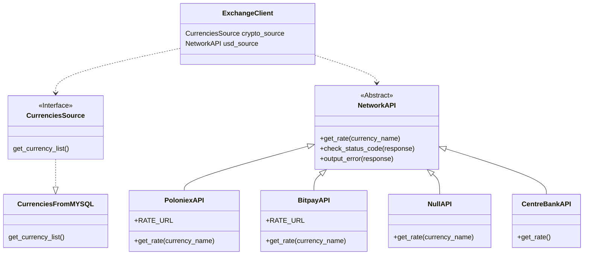

# Обменник валюты
Можно обменивать крипту на рубли и обратно.  
Клиент создаёт заказы на обмен, заказы видны в админ-панеле  
Курсы криптовалют берутся из API крипто-бирж  
Курс доллара берётся из API центрбанка  
Приложение асинхронно, для этого используется httpx и asgi  
# Из чего сделан
Бэк: Django, httpx  
Фронт: html, css, js, шаблонизатор jinja
# Как запустить проект
```mkdir Exchange-clone``` создать пустую папку  
```cd Exchange-clone``` перейти в папку  
```git clone https://github.com/makeevnikita/Exchange.git``` клонировать репозиторий  
```python3 -m venv venv``` создать виртуальное окружение  
```source venv/bin/activate``` активировать виртуальное окружение  
```pip install daphne``` установить ASGI-сервер  
```pip install httpx``` библиотека для отправки асинхронных HTTP-запросов  
```pip install django``` установить Django  
```daphne Exchange.asgi:application``` запустить приложение  

# Структура проекта  
+cryptosite/  
+--cryptosite/  
+--------asgi.py  
+--------settings.py  
+--------urls.py  
+--------wsgi.py  
+--main/  
+--------migrations/  
+--------templates/    
+--------admin.py  
+--------exceptions.py  
+--------exchangenetwork.py
+--------models.py  
+--------services.py  
+--------tests.py  
+--------urls.py  
+--------views.py  
+--media/  
+--------images/  
+---------------coins/  
+--static/  
+--------admin/  
+--------main/  
+---------------css/  
+---------------images/  
+---------------js/  
+--templates/  
+db.sqlite3  
+manage.py  
# Схема базы данных
TODO
# Диаграмма exchangenetwork.py
Этот модуль служит для того, чтобы вытягивать курсы валют из сторонних API.  

